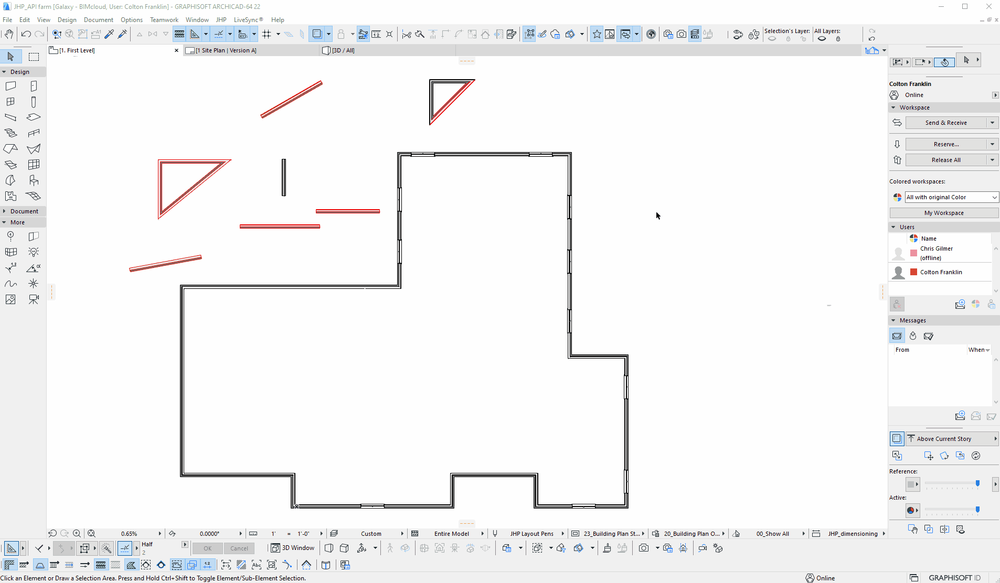

# JHP Menu plugin
#### Documentation and Information | [Changelog](Documentation/Changelog.md)

Description:

The **JHP Menu** plugin is developed using the Archicad API. It is written in C++ and makes use of Graphisoft provided functions and libraries. The goal of the project is to ultimately provide a work environment with utilities, methods, and examples to facilitate the creation of JHP-specific menu items and user functions that *enhance* the experience when using the program in our office.

 

Example of real-time feedback using the *Wall Checker* tool:

